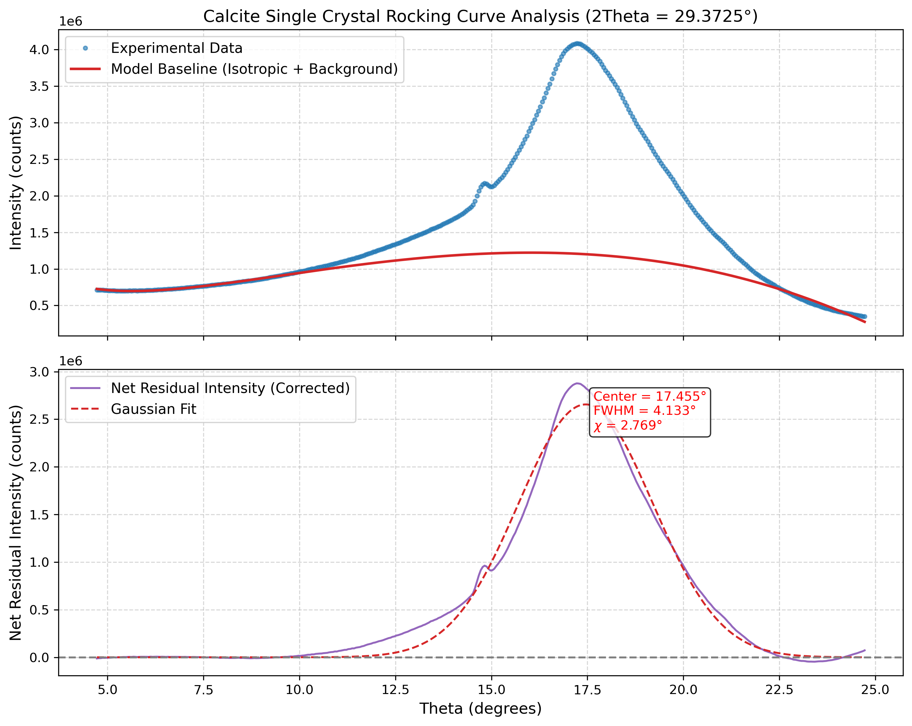

### Comprehensive XRD characterisation {-}
**Date:** 16 June 2026

\thispagestyle{plain}

---
# Summary

This study establishes the crystallographic texture and helical columnar growth mechanism of calcium carbonate ($\text{CaCO}_3$) thin films through a combination of two-dimensional X-ray diffraction (2D-XRD) screening and systematic azimuthal-rotation-dependent ($\phi$) rocking curve ($\theta$) sweeps. While initial stationary 2D-XRD measurements yield continuous Debye–Scherrer rings that classify all films as "mainly isotropic" (Figures 1–4, Table 1), the local intensity fluctuations (graininess) along the rings suggest a highly oriented microstructure. High-resolution $\theta-\phi$ rocking curve mapping of the calcite (104) reflection reveals a clear distinction in texture: samples `SH-125-A`, `SH-125-G`, and `SH-104-1` exhibit a uniaxial fibre texture (in-plane isotropic but out-of-plane tilted, Figure 7b–d and Figure 8b–d), whereas sample `SH-124-B3` exhibits strong template-guided in-plane epitaxial locking, with intensities concentrated at specific substrate-guided azimuthal orientations ($\phi \approx 60^\circ$ and $120^\circ$, Figure 8a). Multi-peak fitting of the baseline-corrected rocking curves resolves discrete tilt domains (Table 2); for the epitaxially locked `SH-124-B3`, the intensity peaks symmetrically at $\chi_1 \approx -4.6^\circ$ (Tilted 1) and $\chi_2 \approx +7.7^\circ$ (Tilted 2), while falling to near-zero at the specular orientation ($\chi \approx 0^\circ$, Figure 7a). This split tilt distribution is crystallographically consistent with a helical columnar growth model where the calcite (104) plane normals precess in a cone around a slightly tilted growth axis ($\delta \approx 1.5^\circ$) with a helix tilt angle $\alpha_0 \approx 5^\circ - 8^\circ$. The universal emergence of these tilted components—both in the epitaxially locked film and as broad deconvoluted domains in the fibre-textured films (Figures 9–11)—demonstrates that tilted columnar growth is an intrinsic feature of the carbonate film synthesis, with substrate-template interaction determining the degree of in-plane alignment.

---
# 1. Introduction and rationale for azimuthal rocking curves

## Rationale for azimuthal rocking curves based on 2D-XRD graininess
Two-dimensional X-ray diffraction (2D-XRD) measurements using a flat-panel detector represent a standard initial characterisation step for phase and texture screening. However, a single stationary 2D detector frame only intersects a specific (and random) planar slice of reciprocal space. It is therefore mathematically unable to distinguish between an isotropic out-of-plane fibre texture (where crystallite tilts are randomly distributed around the surface normal) and a true template-guided in-plane epitaxial confinement.

Initial 2D-XRD characterisation of the calcium carbonate (CaCO3) films (samples `SH-124-B3`, `SH-125-A`, `SH-125-G`, and `SH-104-1`) yielded continuous Debye–Scherrer rings. Automated statistical analysis of the azimuthal intensity variations along these rings, executed by the screening script `scripts/2D_XRD/01_process_2d_xrd.py` and output to the 2D texture metrics table (Table 1), resulted in low values for both the Coefficient of Variation (CV < 0.04) and the Degree of Anisotropy (DoA < 0.10). Consequently, all samples were automatically classified as "mainly isotropic".

Despite this classification, the azimuthal intensity profiles along the rings exhibited distinct localised intensity fluctuations and discrete high-intensity reflections (graininess). This graininess is physically inconsistent with a homogeneous, fine-grained isotropic powder. Instead, it indicates a multimodal crystallite size distribution consisting of a fine-grained, randomly oriented polycrystalline matrix superimposed with larger, possibly, co-orientated crystalline domains. To resolve whether these co-orientated domains represent a weak fibre texture or are epitaxially locked to the substrate lattice, systematic azimuthal-rotation-dependent ($\phi$) rocking curve ($\theta$) sweeps were performed.

## 2D-XRD texture and orientation metrics table
The quantitative parameters extracted from the initial stationary 2D-XRD patterns are summarised in Table 1.

| Sample ID | Description | calcite peaks | vaterite peaks | calcite CV | vaterite CV | Max DoA | Classification |
| :--- | :--- | :---: | :---: | :---: | :---: | :---: | :--- |
| **SH-104-1** | CaCO3 Thin Film | 7 | 1 | 0.020 | 0.022 | 0.084 | Mainly Isotropic |
| **SH-124-B3 S1** | CaCO3 Film, Condition B3 | 7 | 1 | 0.012 | 0.010 | - | Mainly Isotropic |
| **SH-124-B3 S2** | CaCO3 Film, Condition B3 (Rep) | 7 | 1 | 0.018 | 0.037 | - | Mainly Isotropic |
| **SH-125-A S1** | CaCO3 Film, Condition A | 5 | 6 | 0.011 | 0.007 | - | Mainly Isotropic |
| **SH-125-A S2** | CaCO3 Film, Condition A (Rep) | 5 | 7 | 0.009 | 0.006 | - | Mainly Isotropic |
| **SH-125-G** | CaCO3 Film, Condition G | 7 | 6 | 0.009 | 0.009 | - | Mainly Isotropic |

**Table 1:** Summary of phase matches and orientation metrics from stationary 2D-XRD cake-plot profiles. CV denotes the Coefficient of Variation, which measures the relative variability of the azimuthal intensity along the diffraction rings. DoA denotes the Degree of Anisotropy, representing the anisotropy metric calculated from the Fourier coefficients of the azimuthal profile.

## 2D-XRD visualisation
Figure 1 shows the precursor 2D-XRD dataset for the biphasic thin film `SH-125-G`. The continuous rings in the cake plot show subtle intensity modulations (graininess) that provided a foundation for the rocking curve sweeps. Similar continuous ring features and low anisotropy metrics were observed for all other samples (`SH-124-B3`, `SH-125-A`, and `SH-104-1`), confirming their initial screening as mainly isotropic. Figures 1, 2, 3, and 4 present the 2D-XRD analysis for the four CaCO3 thin-film samples, including both the resampled polar cake plots and the original detector images before resampling.

.](../figures/fig1_2d_xrd_analysis_sh_125_g.png){width=85%}

.](../figures/fig2_2d_xrd_analysis_sh_124_b3.png){width=85%}

.](../figures/fig3_2d_xrd_analysis_sh_125_a.png){width=85%}

.](../figures/fig4_2d_xrd_analysis_sh_104_1.png){width=85%}

\newpage

# 2. Phase stability and azimuthal confinement of vaterite

## Epitaxial locking of transient vaterite (110) crystallites
Symmetric $2\theta-\theta$ diffraction scans collected at different azimuthal rotation angles $\phi$ (varying from $0^\circ$ to $180^\circ$ in steps of $30^\circ$) reveal distinct phase-stability and texture behaviours. While calcite (104) is stable and detected at $2\theta \approx 29.4^\circ$ across all azimuthal rotations, the vaterite (110) reflection (at $2\theta \approx 32.8^\circ$) is highly localised.

In sample `SH-125-G`, vaterite is exclusively resolved at $\phi = 30^\circ$ and $\phi = 60^\circ$ (with calcite-to-vaterite integrated area ratios of 189.2 and 117.5, respectively; see Figure 6 for the phase area analysis and Figure 5 for the stacked $2\theta-\theta$ scans). In samples `SH-104-1` and `SH-124-B3`, vaterite is not resolved above the detection limit at any azimuthal angle. Since the physical phase fraction in the film is stationary, this azimuthal selectivity demonstrates that the vaterite crystallites are not randomly oriented in-plane. Instead, they exhibit a strong preferred in-plane epitaxial confinement, satisfying the Bragg condition only at these specific substrate-guided azimuthal orientations.

## Symmetric 2Theta scans stacked
Figure 5 shows the symmetric $2\theta-\theta$ diffraction patterns for all measured $CaCO_3$ thin-film samples, stacked with vertical offsets. Panel (a) highlights the highly selective azimuthal emergence of the vaterite (110) reflection in `SH-125-G`, while panels (b) and (c) display the profiles for `SH-124-B3` (pure calcite) and `SH-125-A` (isotropic mixed phase), respectively, and panel (d) shows sample `SH-104-1`.

.](../figures/fig5_stacked_2theta_all_samples.png){width=85%}

## Phase metrics vs. phi
Figure 6 displays the integrated area of the calcite (104) and vaterite (110) peaks as a function of the azimuthal angle $\phi$, illustrating the selective orientation window. These integrated Bragg peak areas are determined by fitting a 3rd-order polynomial background and Gaussian peaks to each symmetric scan (illustrated in Appendix Figure A6).

.](../figures/fig6_phase_metrics_vs_phi.png){width=85%}

\newpage

# 3. Rocking curve analysis and 2D texture pole figures

## Resolution of 2D polar texture (pole figures)
By collecting 1D rocking curves ($\theta$) at multiple azimuthal rotation angles $\phi$ and mapping the baseline-corrected intensities to a 2D polar coordinate system (where radius represents the domain tilt angle $\chi$), the full texture distribution is resolved. 

Here, the tilt angle $\chi$ represents the crystallographic tilt of the calcite (104) lattice planes relative to the physical substrate/film surface normal. In this geometry, the specular Bragg condition for flat, non-tilted planes is met when the angle of incidence $\theta$ is exactly half of the scattering angle $2\theta_{Bragg}$ (where $2\theta_{Bragg} \approx 29.4^\circ$ for calcite (104)). This defines the nominal specular reference angle $\theta_0 \approx 14.7^\circ$. 

Specifically, to correct for any minor physical sample misalignment, height displacement, or goniometer zero-point offset during the measurement, the specular reference angle $\theta_0(\phi)$ is determined dynamically for each azimuthal orientation $\phi$ by fitting the calcite (104) reflection in the corresponding symmetric $2\theta-\theta$ scan:
$$\theta_0(\phi) = \frac{2\theta_{Bragg}(\phi)}{2}$$
The net crystallite tilt angle $\chi$ is then calculated for each data point as the angular deviation of the rocking angle $\theta$ from this local specular reference:
$$\chi = \theta - \theta_0(\phi)$$

The baseline-corrected net intensity profiles are highly anisotropic and depend strongly on the azimuth $\phi$. For the pure calcite film `SH-124-B3`, active tilt domains appear at $\chi \approx -1.8^\circ$ and $+7.7^\circ$, localised within the $\phi = 60^\circ - 120^\circ$ sector. Similarly, the biphasic film `SH-125-G` exhibits active tilt reflections peaking at $\phi = 60^\circ$ and $120^\circ$, while showing negligible intensity at other rotations. This localised, grainy modulation of rocking curve peak profiles as a function of $\phi$ provides direct crystallographic evidence of in-plane epitaxial locking and confirms the absence of an isotropic out-of-plane fibre texture (shown in the 1D rocking curves of Figure 7 and mapped in the 2D polar projections of Figure 8).

## Stacked net rocking curves
Figure 7 displays the baseline-corrected net rocking curves stacked on a linear scale.

.](../figures/fig7_stacked_net_rocking_curves.png){width=85%}

## 2D polar texture figures
Figure 8 compares the reconstructed 2D polar texture plots (pole figures) for the four samples.

![**Figure 8:** 2D polar projection (pole figures) of the calcite (104) net rocking curve intensities for (a) `SH-124-B3`, (b) `SH-125-A`, (c) `SH-104-1`, and (d) `SH-125-G`. The radial axis represents the tilt angle $\chi$ up to $10^\circ$, and the angular axis represents the azimuth $\phi$. The concentric blue and green dashed circles highlight the tilt angles of the two primary active tilt domains at $\chi = 1.8^\circ$ and $\chi = 7.7^\circ$, respectively. High-resolution vector graphics are available in [fig8_texture_pole_figures.svg](../figures/fig8_texture_pole_figures.svg).](../figures/fig8_texture_pole_figures.png){width=85%}

### Interpretation of 2D polar texture figures (pole figures)
To correctly read and understand the 2D polar texture figures (Figure 8), they should be interpreted as follows:
* **Coordinate Grid**: 
  - **Radial coordinate ($R = \chi$)**: Represents the crystallographic tilt angle $\chi$ of the calcite (104) lattice planes relative to the substrate surface normal. The center ($R = 0^\circ$) represents the perfectly specular orientation. The concentric blue and green dashed circles at $R = 1.8^\circ$ and $R = 7.7^\circ$ mark the nominal tilt angles of the resolved active tilt domains.
  - **Angular coordinate ($\phi$)**: Represents the azimuthal rotation angle of the sample in-plane, spanning from $0^\circ$ to $360^\circ$.
* **Intensity Color Mapping**: The colorbar indicates the net diffraction intensity. Darker colors (blue/purple) indicate background noise or the absence of Bragg diffraction, while brighter colors (yellow/white) represent high-intensity diffraction peaks where the Bragg condition is strongly satisfied.
* **Texture Characteristics**:
  - **Isotropic Texture (Random In-plane Orientation)**: Appears as continuous, uniform circular rings in the pole figures. For example, in `SH-125-A` (Figure 8b) and `SH-104-1` (Figure 8c), the intensity is distributed evenly across all $\phi$ angles, showing that the crystallites are randomly oriented in-plane, despite having a preferred out-of-plane tilt.
  - **Anisotropic/Epitaxially Locked Texture**: Appears as localized, high-intensity spots ("poles") rather than complete rings. In `SH-124-B3` (Figure 8a), the intensity is highly concentrated at $\phi \approx 60^\circ$ and $120^\circ$ along the outer green dashed ring ($\chi = 7.7^\circ$), showing a strong epitaxial confinement matching the substrate symmetry. In `SH-125-G` (Figure 8d), the intensity is similarly localized at $\phi \approx 60^\circ$ and $120^\circ$ along the inner blue dashed ring ($\chi = 1.8^\circ$).

\newpage

# 4. Crystallographic evidence for helical and columnar growth

## Helical columnar microstructure model
Electron microscopy imaging suggests that these CaCO3 films grow via a columnar mechanism, where individual columns exhibit a helical twist along their growth axis. The rocking curve data provide direct crystallographic verification of this growth model.

Fitting multi-peak Gaussian assemblies to the baseline-corrected rocking curves resolves discrete tilt components. The most prominent reflections are symmetrically tilted at $\chi \approx -1.8^\circ$ and $+7.7^\circ$ relative to the substrate normal (as seen in Figure 7a, Figure 8a, and Table 2). 

In the context of a helical columnar microstructure, the crystal lattice planes (calcite 104) grow with a characteristic tilt angle $\alpha_0$ relative to the growth axis of the column. As the column twists helically during growth, the normal of these planes precesses around the growth axis, generating a conical distribution of plane normals (a precession cone of half-angle $\alpha_0$). If the column growth axis itself is tilted by an angle $\delta$ relative to the substrate surface normal in the plane of the measurement, the observed tilt angle $\chi$ of the plane normals relative to the substrate normal varies between:
$$\chi_{1,2} = \delta \pm \alpha_0$$
This leads to two symmetric peak reflections in the rocking curve. 

For the representative sample `SH-124-B3`, the outermost fitted peaks are Peak 1 (negative tilt, $\chi_1 \approx -4.6^\circ$ to $-7.0^\circ$ across all $\phi$ angles) and Peak 5 (positive tilt, $\chi_2 \approx +7.7^\circ$ to $+8.5^\circ$). By solving this system of equations:
1. The precession center (column axis tilt relative to the substrate normal) is $\delta = (\chi_2 + \chi_1)/2 \approx +1.5^\circ$.
2. The precession cone half-angle (helix tilt angle $\alpha_0$) is $\alpha_0 = (\chi_2 - \chi_1)/2 \approx 6^\circ - 7.5^\circ$.

The resolved tilt components match this conical geometry, indicating a helix tilt angle $\alpha_0 \approx 5^\circ - 8^\circ$ across the different sample growth series and orientations.

Furthermore, the individual peak components exhibit narrow line shapes, with full width at half maximum ($FWHM$) values ranging between $0.2^\circ$ and $0.5^\circ$. This FWHM is close to the instrumental resolution limit, demonstrating that the helical columns have high crystallographic quality with very low internal mosaicity (misorientation spread) within each domain (fitted parameters compiled in Table 2; see Figure A2 for peak deconvolution and Figure A5 for the single-crystal calibration standard).

## Microstructural interpretation of the resolved peaks
The multiple components resolved within the rocking curve profiles provide detailed insights into the thin-film growth history:
1. **The coexistence of specular and tilted domains in isotropic-like samples:** In the mainly isotropic-like samples (`SH-125-A`, `SH-125-G`, and `SH-104-1`), a 2-peak deconvolution reveals that the rocking curves are not composed of a single extremely broad specular reflection. Instead, they consist of two distinct, overlapping components: a **Specular Peak** centered near the specular angle ($\theta \approx 14.5^\circ$ to $16.5^\circ$, corresponding to $\chi \approx -0.8^\circ$ to $+2.0^\circ$) and a **Tilted Peak** centered at $\theta \approx 11.5^\circ$ to $13.0^\circ$ ($\chi \approx -2.5^\circ$ to $-3.0^\circ$). Both components exhibit moderate mosaicity (FWHM $\approx 3.0^\circ$ - $4.5^\circ$). This resolves the previously inferred, unphysically broad single-peak widths, confirming that tilted crystallographic domains are a universal growth feature of these carbonate films, regardless of their apparent 1D azimuthal symmetry (see Figures 7b-d, Figures 8b-d, and Table 2).
2. **The symmetrical tilt peaks ($\chi \approx -1.8^\circ$ and $+7.7^\circ$):** These peaks match the precession of the (104) plane normals in helical columns. The asymmetric tilt distribution suggests a slight tilt of the column growth axes or a preferred chirality during growth. Specifically, the component at $\chi \approx -1.8^\circ$ may represent early-stage column growth before the helical twist pitch is fully established (see Table 2, Figure 7a, and Figure 8a).
3. **The minor peak components ($\chi \approx +2.5^\circ$ and $+2.9^\circ$):** These narrow tilt reflections represent secondary crystalline facets or variations in the helical pitch as the columnar structures evolve. The high reproducibility of these minor tilt components across independent growth series (`SH-124-B3` and `SH-125-A`) indicates a highly deterministic orientation pathway, likely dictated by specific low-energy growth facets (see Table 2).

## Rocking curve peak fit parameters table
The quantitative parameters of key active tilt reflections are summarised in Table 2.

| Sample | $\phi$ (°) | Peak Name | Center $\theta$ (°) | Tilt $\chi$ (°) | FWHM (°) | Height (cts) | Area (cts·°) | Area/Base |
| :--- | :---: | :--- | :---: | :---: | :---: | ---: | ---: | ---: |
| **Single Crystal** | Reference | calcite (104) reference | 17.455° | 2.769° | 4.133° | 2655872.9 | 11.68M | 3528.6% |
| **SH-124-B3** | 60 | Peak 1 (Tilt) | 10.114° | -4.603° | 0.650° | 4976.1 | 3442.6 | 17.001% |
| **SH-124-B3** | 60 | Peak 1b (Tilt) | 10.980° | -3.737° | 0.650° | 2821.5 | 1952.0 | 10.455% |
| **SH-124-B3** | 60 | Peak 2a (Tilt) | 12.136° | -2.580° | 0.637° | 2124.4 | 1439.6 | 8.511% |
| **SH-124-B3** | 60 | Peak 2b (Tilt) | 12.763° | -1.954° | 0.650° | 2576.3 | 1782.2 | 11.071% |
| **SH-124-B3** | 120 | Peak 1 (Tilt) | 10.123° | -4.578° | 0.645° | 1750.1 | 1201.6 | 0.884% |
| **SH-124-B3** | 120 | Peak 1b (Tilt) | 10.819° | -3.881° | 0.596° | 2313.1 | 1466.9 | 1.152% |
| **SH-124-B3** | 120 | Peak 2a (Tilt) | 11.700° | -3.000° | 0.613° | 2244.2 | 1464.6 | 1.243% |
| **SH-124-B3** | 120 | Peak 2b (Tilt) | 13.167° | -1.533° | 0.604° | 2077.8 | 1334.8 | 1.272% |
| **SH-125-A** | 0 | Tilted Peak | 11.867° | -2.838° | 3.665° | 4791.4 | 18.69k | 17.385% |
| **SH-125-A** | 0 | Specular Peak | 15.588° | 0.883° | 3.969° | 4562.1 | 19.27k | 23.424% |
| **SH-125-G** | 60 | Specular Peak | 15.335° | 0.646° | 4.362° | 1927.6 | 8.95k | 13.592% |
| **SH-125-G** | 60 | Tilted Peak | 12.130° | -2.558° | 4.039° | 3303.6 | 14.20k | 17.137% |
| **SH-104-1** | 60 | Tilted Peak | 16.958° | 2.241° | 3.099° | 2819.5 | 9.30k | 32.856% |
| **SH-104-1** | 60 | Specular Peak | 13.897° | -0.820° | 4.341° | 5641.4 | 26.07k | 75.848% |

**Table 2:** Rocking curve peak parameters and tilt state metrics for representative active azimuthal orientations.

# 5. Experimental calibration and baseline verification

## Calibration standards and background verification
To establish the instrumental resolution and verify the integrity of the peak fittings, a single-crystal calcite reference and an empty sample holder were characterised.

Symmetric rocking curve scans of the calcite single crystal yield a single, narrow Bragg peak centered at $\theta = 17.46^\circ$ with a $FWHM = 4.13^\circ$, corresponding to an instrumental profile superimposed on a cleavage miscut of $\chi = +2.77^\circ$. This profile defines the maximum expected FWHM for a single-domain reflection in this geometry (shown in Appendix Figure A5).

Diffraction scans of the empty sample holder show a featureless, flat background with a standard deviation below 0.6% of the mean intensity. This confirms that the sample holder does not introduce spurious reflections or diffraction features that could interfere with the peak fitting or be misidentified as weak thin-film reflections.

## Baseline verification for isotropic thin-film specimens
For the mainly isotropic thin-film specimens (`SH-125-A`, `SH-125-G`, and `SH-104-1`), the baseline subtraction procedure is verified by plotting the raw intensity alongside the fitted morphological/isotropic model baseline and the resulting net residual intensity.

Figure 9 shows this comparison for sample `SH-125-A` at $\phi = 0^\circ$. The isotropic model baseline (red line) successfully fits the broad diffuse scatter, and the net residual intensity (purple line) resolves the deconvolution into tilted and specular peak components.

{width=85%}

Figures 10 and 11 show the stacked raw curves and corresponding baseline-corrected net curves at all measured azimuthal angles for samples `SH-125-G` and `SH-104-1`, respectively. These plots demonstrate the stability of the baseline subtraction routine across the entire azimuthal range, confirming that the weak, broad specular features are consistently isolated without generating unphysical artefacts.

{width=85%}

{width=85%}

# 6. High-Resolution Figure Source Files
The figures presented in this report have been exported as high-resolution, vector-format SVG files to enable direct incorporation into the manuscript:
1. Figures 1-4 (2D-XRD detector frame, cake plot, and 1D profile for all samples):
   - Sample `SH-125-G` (Figure 1): [fig1_2d_xrd_analysis_sh_125_g.svg](../figures/fig1_2d_xrd_analysis_sh_125_g.svg)
   - Sample `SH-124-B3` (Figure 2): [fig2_2d_xrd_analysis_sh_124_b3.svg](../figures/fig2_2d_xrd_analysis_sh_124_b3.svg)
   - Sample `SH-125-A` (Figure 3): [fig3_2d_xrd_analysis_sh_125_a.svg](../figures/fig3_2d_xrd_analysis_sh_125_a.svg)
   - Sample `SH-104-1` (Figure 4): [fig4_2d_xrd_analysis_sh_104_1.svg](../figures/fig4_2d_xrd_analysis_sh_104_1.svg)
2. Figure 5 (Azimuthal dependence of symmetric 2Theta scans for all samples): [fig5_stacked_2theta_all_samples.svg](../figures/fig5_stacked_2theta_all_samples.svg)
3. Figure 6 (Phase areas vs. azimuthal angle $\phi$ for all samples): [fig6_phase_metrics_vs_phi.svg](../figures/fig6_phase_metrics_vs_phi.svg)
4. Figure 7 (Stacked baseline-corrected net rocking curves for all samples): [fig7_stacked_net_rocking_curves.svg](../figures/fig7_stacked_net_rocking_curves.svg)
5. Figure 8 (2D polar texture pole figures for all samples): [fig8_texture_pole_figures.svg](../figures/fig8_texture_pole_figures.svg)
6. Figure A1 (Rocking curve background subtraction): [fig_a1_background_subtraction.svg](../figures/fig_a1_background_subtraction.svg)
7. Figure A2 (Zoomed net peak deconvolution): [fig_a2_peak_deconvolution.svg](../figures/fig_a2_peak_deconvolution.svg)
8. Figure A3 (Zoomed rocking curve fit at phi=30): [fig_a3_sh124b3_fit_phi_30_zoom.svg](../figures/fig_a3_sh124b3_fit_phi_30_zoom.svg)
9. Figure A4 (Zoomed net peak deconvolution at phi=30): [fig_a4_sh124b3_fit_phi_30_net_zoom.svg](../figures/fig_a4_sh124b3_fit_phi_30_net_zoom.svg)
10. Figure A5 (Calcite single crystal rocking curve): [fig_a5_calcite_single_crystal_analysis.svg](../figures/fig_a5_calcite_single_crystal_analysis.svg)
11. Figure A6 (Symmetric diffraction scan peak fitting demonstration): [fig_a6_symmetric_peak_fits.svg](../figures/fig_a6_symmetric_peak_fits.svg)
12. Figure A7 (Comprehensive rocking curve fits for sample `SH-124-B3` at all azimuthal angles): [fig_a7_sh124b3_fits.svg](../figures/fig_a7_sh124b3_fits.svg)
13. Figure A8 (Comprehensive rocking curve fits for sample `SH-125-A` at all azimuthal angles): [fig_a8_sh125a_fits.svg](../figures/fig_a8_sh125a_fits.svg)
14. Figure A9 (Comprehensive rocking curve fits for sample `SH-125-G` at all azimuthal angles): [fig_a9_sh125g_fits.svg](../figures/fig_a9_sh125g_fits.svg)
15. Figure A10 (Comprehensive rocking curve fits for sample `SH-104-1` at all azimuthal angles): [fig_a10_sh1041_fits.svg](../figures/fig_a10_sh1041_fits.svg)

\newpage

# Appendix: Data processing steps

This appendix outlines the quantitative data processing and analysis steps performed on the precursor 2D-XRD detector frames and the azimuthal rocking curves.

## 1. 2D-XRD data processing
1. **Raw frame processing**: 2D flat-panel detector frames (originally collected in Bruker `.gfrm` format) were read, and pixel coordinates were mapped to the scattering angle $2\theta$ and the azimuthal detector angle $\phi$ using calibration coefficients determined from a standard Corundum calibrant.
2. **Polar resampling (cake plots)**: The intensity map was resampled from detector pixel space onto a regular grid of $2\theta \in [20^\circ, 55^\circ]$ and $\phi \in [0^\circ, 360^\circ]$, with grid spacing of $\Delta(2\theta) = 0.02^\circ$ and $\Delta\phi = 1.0^\circ$.
3. **Background subtraction**: The amorphous background was modelled using a morphological opening filter (rolling ball algorithm with a structuring element width of $2.5^\circ$ in $2\theta$) and subtracted to isolate crystalline Bragg reflections.
4. **1D integration**: The 2D polar cake plot was integrated azimuthally along the $\phi$ axis to produce a 1D diffraction profile for peak matching and phase classification.
5. **Texture statistical evaluation**: The Coefficient of Variation ($CV$) and the Degree of Anisotropy ($DoA$) were computed from the intensity variations along the rings. The $CV$ is defined as the standard deviation of the azimuthal profile divided by its mean. The $DoA$ is calculated from the Fourier coefficients of the azimuthal profile:
   $$DoA = \sqrt{\frac{\sum_{n=1}^N (a_n^2 + b_n^2)}{a_0^2}}$$
   Low values ($CV < 0.04$, $DoA < 0.10$) led to automated classification as "mainly isotropic."

## 2. Rocking curve data processing
1. **XML parsing**: Intensity-angle pairs and instrument metadata were extracted from Bruker `.brml` XML file containers.
2. **Thin-film volume correction**: The raw rocking curve intensities ($I_{raw}(\theta)$) were corrected for the geometry-dependent irradiation volume:
   $$I_{corr}(\theta) = I_{raw}(\theta) \cdot \sin\theta$$
3. **Baseline fitting**: A 3rd-order polynomial baseline was fitted to the off-peak region (outside the active rocking window) to subtract background scatter from the sample holder and substrate:
   $$I_{net}(\theta) = I_{corr}(\theta) - \sum_{k=0}^3 c_k \theta^k$$
4. **Multi-peak Gaussian fitting**: Overlapping domain tilts were resolved by fitting a multi-component Gaussian model using non-linear least squares:
   $$I_{net}(\theta) = \sum_{j} h_j \exp\left(-\frac{(\theta - \theta_{0,j})^2}{2 \sigma_j^2}\right)$$
   where $h_j$ is the net peak height, $\theta_{0,j}$ is the peak center, and $FWHM_j = 2.355 \sigma_j$.
5. **2D polar texture reconstruction (pole figures)**: 1D rocking curves collected at azimuthal rotations $\phi \in [0^\circ, 180^\circ]$ were projected onto a 2D polar coordinate system where:
   - Polar radius $r = \chi = \theta - \theta_{0}$ represents the crystallite tilt angle relative to the film normal.
   - Polar angle represents the azimuthal rotation $\phi$.
   The grid was expanded to $360^\circ$ by applying standard crystallographic 2-fold inversion symmetry: $I(\chi, \phi + 180^\circ) = I(-\chi, \phi)$. Grid interpolation was performed using a cubic spline function.

## 3. Background subtraction and peak deconvolution visualisation
To demonstrate the physical validity of the background subtraction and multi-peak Gaussian fitting procedures, representative azimuthal scans from the pure calcite sample `SH-124-B3` are illustrated in Figures A1, A2, A3, and A4.

Figure A1 shows the raw rocking curve intensity of `SH-124-B3` at $\phi = 60^\circ$ alongside the fitted 3rd-order polynomial background baseline and the total fit envelope in both linear and logarithmic scales. The background baseline captures the diffuse substrate scatter, and the logarithmic plot demonstrates that the fit envelope matches the experimental data points across more than two orders of magnitude in intensity, justifying the baseline subtraction rationale.

{width=85%}

Figure A2 shows the resulting baseline-corrected net intensity profile at $\phi = 60^\circ$. Subtracting the baseline isolates the crystalline Bragg reflections at the $y=0$ baseline. Non-linear least-squares fitting of the net profile resolves the individual Gaussian tilt components, showing agreement with the experimental net data points and confirming that individual domain tilts can be deconvoluted from the overlapping Bragg reflections.

![**Figure A2:** Deconvoluted net rocking curve and individual Gaussian peak components for sample `SH-124-B3` at $\phi = 60^\circ$ inside the domain tilt range ($\theta \in [10.0^\circ, 14.5^\circ]$).](../figures/fig_a2_peak_deconvolution.png){width=85%}

Figures A3 and A4 show the corresponding raw fit and baseline-corrected net peak deconvolution for the same sample `SH-124-B3` at $\phi = 30^\circ$. These figures highlight the consistency of the fitting model at a different azimuthal angle, where the peak intensities are lower but the same tilt domain centers are resolved.

{width=85%}

{width=85%}

Figure A5 shows the rocking curve and Gaussian fit for the calcite single crystal calibration standard. The sharp, symmetric profile confirms the alignment and instrumental resolution profile.

{width=85%}

Figure A6 shows a representative symmetric diffraction scan peak fitting sequence for sample `SH-125-G` at $\phi = 30^\circ$. This specimen contains both calcite and vaterite phases, demonstrating how the linear background baseline and the 5-peak Gaussian functions are fitted jointly to resolve the integrated areas of the calcite (104), vaterite (110), and secondary reflections at 28.5°, 31.5°, and ~33.8°.

{width=85%}

Figures A7 to A10 compile the complete, step-by-step rocking curve fits for all samples at all measured azimuthal orientations $\phi$, allowing a detailed review of the fits on a log-intensity scale.

{width=100%}

{width=100%}

{width=100%}

{width=100%}

